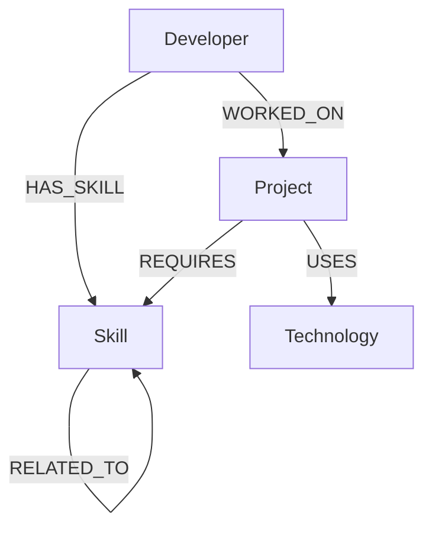
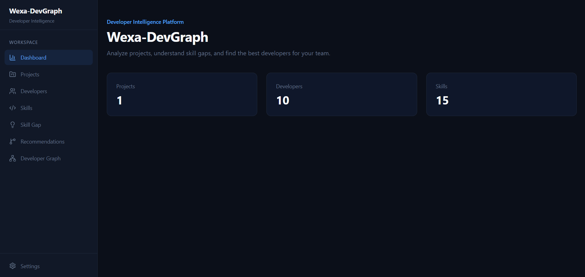
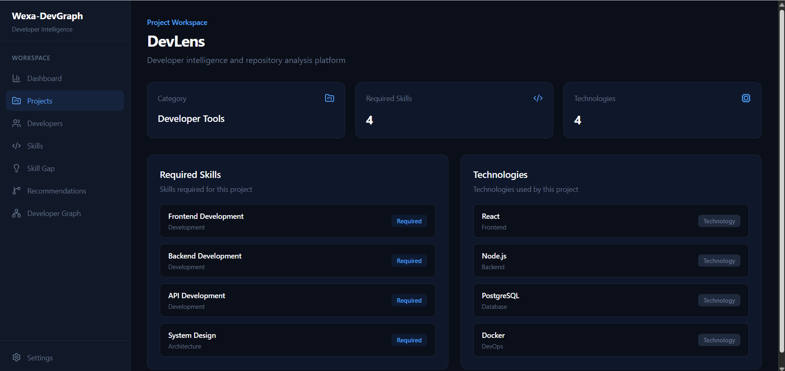
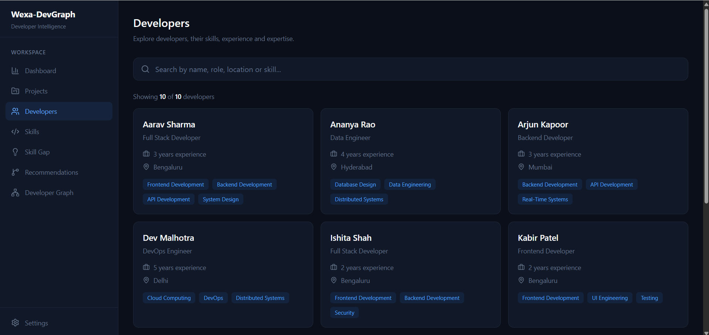
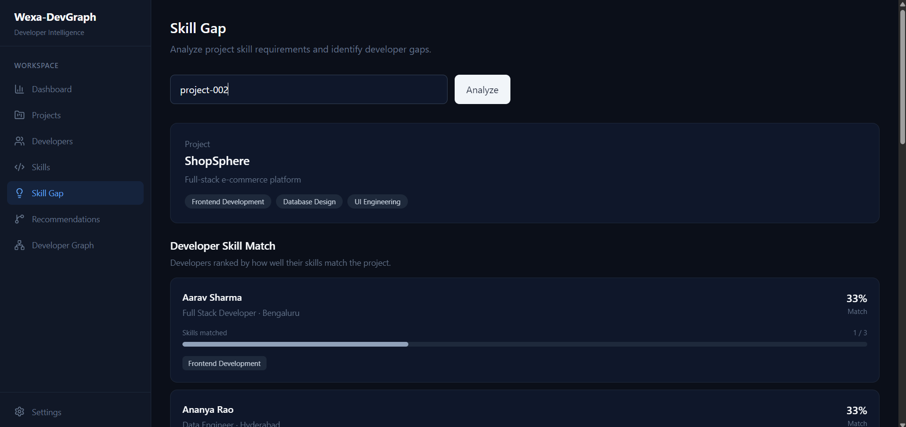
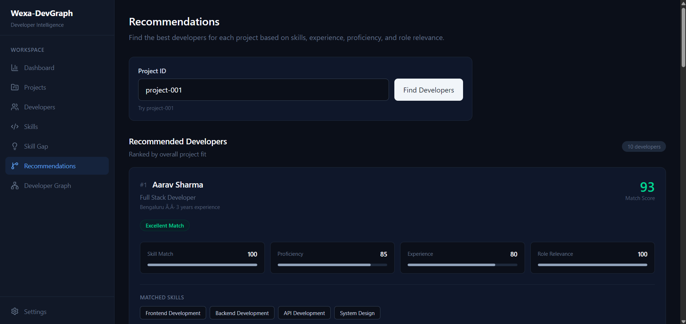
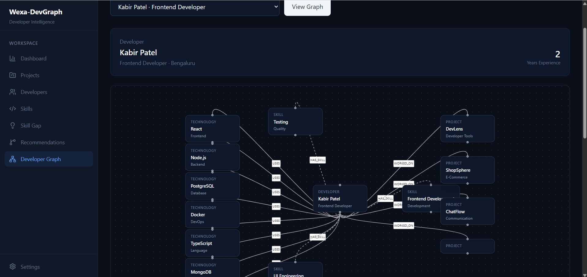
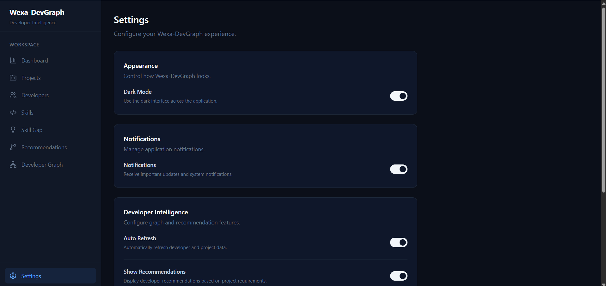

# Wexa DevGraph

A developer intelligence platform built on a graph database. Wexa DevGraph models the relationships between developers, projects, skills, and technologies as a connected graph, enabling queries that would be cumbersome or multi-step in a relational design — such as finding the best-fit developers for a project, calculating skill gaps, or traversing the skills a project needs through to the technologies that implement them.

---

## Live Demo

| Service | URL |
|---|---|
| Frontend (Vercel) | https://wexa-dev-graph.vercel.app |
| Backend health check (Render) | https://wexa-devgraph-x6pv.onrender.com/health |

---

## Problem / Use Case

Engineering teams frequently face a core intelligence problem: given a project with specific skill requirements, which developers are best suited to work on it, and what gaps exist for those who aren't a perfect match?

Answering this in a traditional system means joining across a developer table, a skills table, a project-skills table, and a developer-skills table — with additional logic to compute proficiency scores, rank by experience, and identify related skills. Every question is a new multi-join query.

Wexa DevGraph models this as a graph from the ground up. Developers, projects, skills, and technologies are nodes. Their relationships — `HAS_SKILL`, `REQUIRES`, `USES`, `RELATED_TO`, `WORKED_ON` — are first-class citizens in the data model. Questions about fit, gaps, and relationships become natural graph traversals.

---

## Why a Graph Database?

The central insight is that **the relationships themselves carry the meaning**, not just the entities.

Consider the key traversal that powers developer recommendations:

```
Developer -[:HAS_SKILL]-> Skill <-[:REQUIRES]- Project -[:USES]-> Technology
```

This single path answers: "which skills does this developer have, which projects require those skills, and what technologies do those projects use?" In Cypher, this is one pattern match. In SQL, it requires at minimum three joins across four tables, with additional application logic to de-duplicate and aggregate.

Here are the concrete relationship-heavy questions the application resolves via graph traversal:

**Developer → Skill → Project (skill gap and matching)**
To find how well a developer matches a project, the query traverses `(Developer)-[:HAS_SKILL]->(Skill)` and compares against `(Project)-[:REQUIRES]->(Skill)`. The overlap, gaps, and percentage are derived in a single Cypher query with list comprehensions — no intermediate result sets, no application-side joining.

**Project → Skill → Developer (recommendations)**
The recommendation engine walks from a project's required skills outward to all developers who hold those skills, then further through `RELATED_TO` edges between skills to surface developers with adjacent expertise. A developer who lacks "Machine Learning" but has "Data Engineering" — which is `RELATED_TO` "Machine Learning" — still scores as a partial match. This kind of neighbor-of-a-neighbor reasoning is a natural graph walk; in relational terms it would require a self-join on the skills table with a bridge table for skill relationships.

**Developer → Skill ← Project → Technology (graph visualization)**
The Developer Graph page renders a four-hop path: for a given developer, traverse their skills, then find which projects require those skills, then pull the technologies each project uses. The Cypher query fetches all of this in one round trip and returns developer, skills, projects, and technologies as a single structured result. A relational equivalent would require at minimum four queries or a deeply nested join.

**Skill → RELATED_TO → Skill (skill adjacency)**
Skills themselves are connected via `RELATED_TO` edges (e.g., "Backend Development" is related to "API Development"; "Cloud Computing" is related to "DevOps"). This lateral skill graph is used both in the Skills page to surface related skills interactively, and in the recommendation scoring to give partial credit. Storing and querying a skill relationship graph in SQL requires an adjacency table and recursive queries or multiple round trips.

In all of these cases, the graph database is not simply "faster" — the queries are **structurally simpler** and match the shape of the actual domain model. The data is inherently relational in the graph sense: it is a network of entities connected by typed, directional relationships with properties on those relationships (e.g., `proficiency` and `years` on `HAS_SKILL`).

---

## Graph Data Model

### Node Labels

| Label | Key Properties |
|---|---|
| `Developer` | `id`, `name`, `role`, `experience`, `location` |
| `Project` | `id`, `name`, `description`, `category` |
| `Skill` | `id`, `name`, `category` |
| `Technology` | `id`, `name`, `category` |

### Relationship Types

| Relationship | From → To | Properties |
|---|---|---|
| `HAS_SKILL` | Developer → Skill | `proficiency`, `years` |
| `REQUIRES` | Project → Skill | — |
| `USES` | Project → Technology | `usage` |
| `RELATED_TO` | Skill ↔ Skill | — |
| `WORKED_ON` | Developer → Project | `role`, `durationMonths` |

### Diagram



### Uniqueness Constraints (applied via `cypher/schema.cypher`)

- `Developer.id`
- `Project.id`
- `Skill.id`
- `Technology.id`

### Seed Data (applied via `backend/src/scripts/seedDatabase.js`)

The graph is seeded with:
- **10 developers** across roles (Full Stack, Backend, Frontend, Data Engineer, Cloud, AI, DevOps)
- **8 projects** across categories (Developer Tools, E-Commerce, FinTech, HealthTech, Data, Cloud, Communication)
- **15 skills** across categories (Development, Data, Architecture, Infrastructure, AI, Quality, Security)
- **15 technologies** across categories (Frontend, Backend, Language, Database, DevOps, Cloud, Infrastructure, AI)
- **32 developer–skill relationships** with proficiency and years
- **25 project–skill relationships**
- **27 project–technology relationships** with usage context
- **15 developer–project relationships** with role and duration
- **14 skill–skill RELATED_TO relationships**

---

## Screenshots

The screenshots below demonstrate the main application workflows and graph-based functionality across all pages.

### Dashboard


### Projects


### Developers


### Skills


### Skill Gap


### Recommendations


### Developer Graph


### Settings


---

## Core Features

### Dashboard
Landing page showing the platform name and a quick-glance summary of the graph (projects, developers, skills counts).

### Developers
Browse all 10 developers with their role, experience, location, and associated skills. A live search filters the list by name, role, location, or any skill name. Data is fetched in a single query that traverses `(Developer)-[:HAS_SKILL]->(Skill)` and returns both in one result.

### Projects
Displays the graph data for a selected project — its required skills and the technologies it uses — sourced from the `(Project)-[:REQUIRES]->(Skill)` and `(Project)-[:USES]->(Technology)` relationships.

### Skills
Browse all skills with a developer count per skill (computed via `(Skill)<-[:HAS_SKILL]-(Developer)` aggregation). Clicking any skill opens a detail modal showing its related skills, fetched by traversing the `RELATED_TO` edges in the skill graph.

### Skill Gap
Enter a project ID to see every developer ranked by how closely their skills match the project's requirements. The match percentage is calculated in Cypher by comparing `(Developer)-[:HAS_SKILL]->(Skill)` against `(Project)-[:REQUIRES]->(Skill)`, with matched and missing skills listed for each developer.

### Recommendations
Enter a project ID to receive a ranked list of recommended developers. The scoring engine runs entirely in Cypher and factors in four dimensions:

- **Skill Match (50%)** — direct skill overlap plus 0.5× credit for skills reachable via `RELATED_TO` edges
- **Proficiency (20%)** — based on the `proficiency` property on `HAS_SKILL` relationships
- **Experience (20%)** — based on the developer's `experience` property
- **Role Relevance (10%)** — whether the developer's role aligns with the project's skill profile

Each developer receives a numeric score (0–100), a match level label (Excellent / Strong / Good / Partial / Poor), and a set of human-readable reason strings explaining the score.

### Developer Graph
Select a developer from a dropdown to render an interactive node-link diagram. The backend executes a four-hop Cypher traversal — developer → skills → projects (via skill requirements) → technologies — and returns the full graph in one query. The frontend renders this using [React Flow](https://reactflow.dev) (`@xyflow/react`) with a pannable, zoomable canvas, minimap, and labeled edges showing relationship types (`HAS_SKILL`, `WORKED_ON`, `USES`).

### Settings
Persistent user preferences stored in `localStorage`: dark/light mode toggle, notifications, auto-refresh, and show/hide recommendations. The dark mode preference propagates to the application theme via a `CustomEvent` on `window`.

---

## Tech Stack

### Backend
| | |
|---|---|
| Runtime | Node.js |
| Framework | Express 5 |
| Graph Database | CognoDB (Neo4j-compatible, accessed via `neo4j-driver` 6) |
| Query Language | Cypher |
| Environment | `dotenv` |

### Frontend
| | |
|---|---|
| Framework | React 19 |
| Routing | React Router 7 |
| HTTP | Axios |
| Graph Visualization | React Flow (`@xyflow/react` 12) |
| Styling | Tailwind CSS 4 |
| Icons | Lucide React |
| Build Tool | Vite 8 |

### Deployment
| | |
|---|---|
| Frontend | Vercel (SPA rewrite via `vercel.json`) |
| Backend | Render |

---

## API Reference

Base URL: `/api`

| Method | Endpoint | Description |
|---|---|---|
| `GET` | `/health` | Database connectivity check |
| `GET` | `/api/developers` | All developers with their skills |
| `GET` | `/api/developers/by-skill?skill=<name>` | Developers filtered by skill name |
| `GET` | `/api/developers/:id/graph` | Developer graph: skills, projects, and technologies |
| `GET` | `/api/projects` | All projects with required skills |
| `GET` | `/api/projects/:id` | Single project graph (skills + technologies) |
| `GET` | `/api/projects/:id/developers` | Developers matched to a project by skill overlap |
| `GET` | `/api/skills` | All skills with developer counts |
| `GET` | `/api/skills/related?skill=<name>` | Skills related to a given skill via `RELATED_TO` |
| `GET` | `/api/skill-gap/developers/:devId/projects/:projId` | Skill gap between a developer and a project |
| `GET` | `/api/recommendations/projects/:projectId/developers` | Ranked developer recommendations for a project |
| `GET` | `/api/graph/stats` | Node and relationship counts for the entire graph |
| `GET` | `/api/graph/developers/:id` | Developer graph (graph service variant) |
| `GET` | `/api/graph/developers/:id/project-technologies` | Developer → Skill → Project → Technology paths |

---

## Local Setup

### Prerequisites
- Node.js 18+
- A CognoDB (or Neo4j-compatible) instance with Bolt access

### Backend

```bash
cd backend
cp .env.example .env
# Fill in COGNODB_URI, COGNODB_USERNAME, COGNODB_PASSWORD
npm install
npm run schema      # Apply uniqueness constraints
npm run seed        # Seed graph with developers, projects, skills, technologies
npm run dev         # Start dev server on port 5000
```

### Frontend

```bash
cd frontend
cp .env.example .env
# Set VITE_API_URL=http://localhost:5000/api
npm install
npm run dev         # Start Vite dev server on port 5173
```

### Useful backend scripts

```bash
npm run verify-schema       # Confirm constraints are applied
npm run verify-data         # Check seeded node/relationship counts
npm run test-graph          # Test developer graph traversal
npm run test-skill-gap      # Test skill gap query
npm run test-recommendations # Test recommendation scoring
```

---

## Project Structure

```
wexa-devgraph/
├── backend/
│   └── src/
│       ├── config/         # CognoDB driver
│       ├── controllers/    # Request handlers
│       ├── routes/         # Express route definitions
│       ├── services/       # Business logic and DB sessions
│       ├── queries/        # Cypher query strings
│       └── scripts/        # Schema, seed, and test scripts
├── frontend/
│   └── src/
│       ├── pages/          # Dashboard, Developers, Projects, Skills,
│       │                   # SkillGap, Recommendations, DeveloperGraph, Settings
│       ├── services/       # Axios API client
│       ├── routes/         # React Router configuration
│       └── components/     # Shared UI components and layout
├── cypher/
│   └── schema.cypher       # Uniqueness constraint definitions
└── seed/
    └── data.js             # Source-of-truth seed data
```
